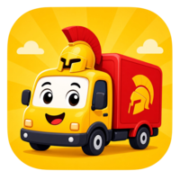
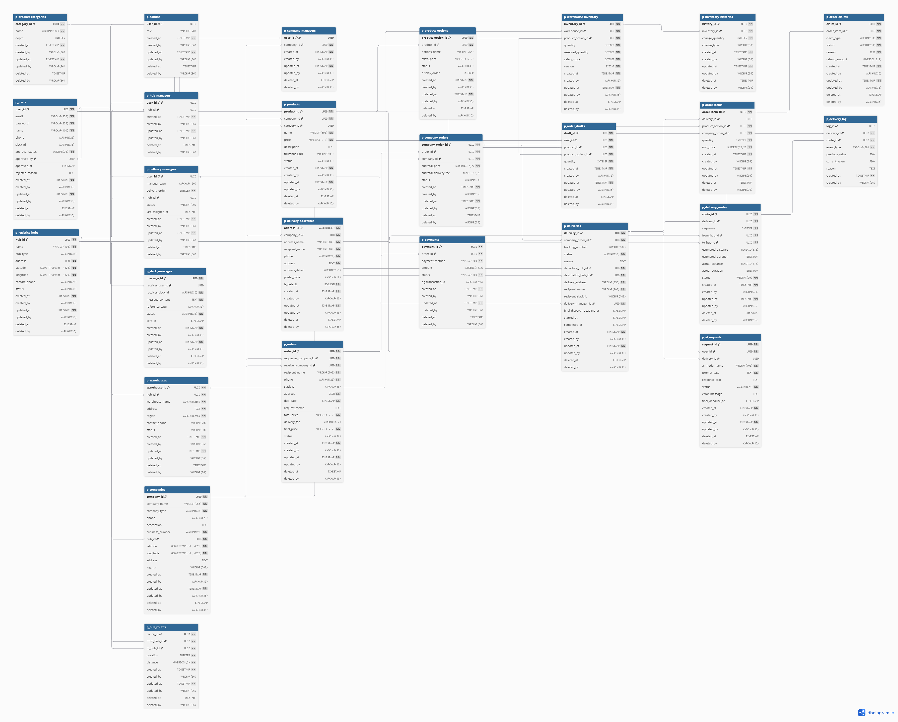
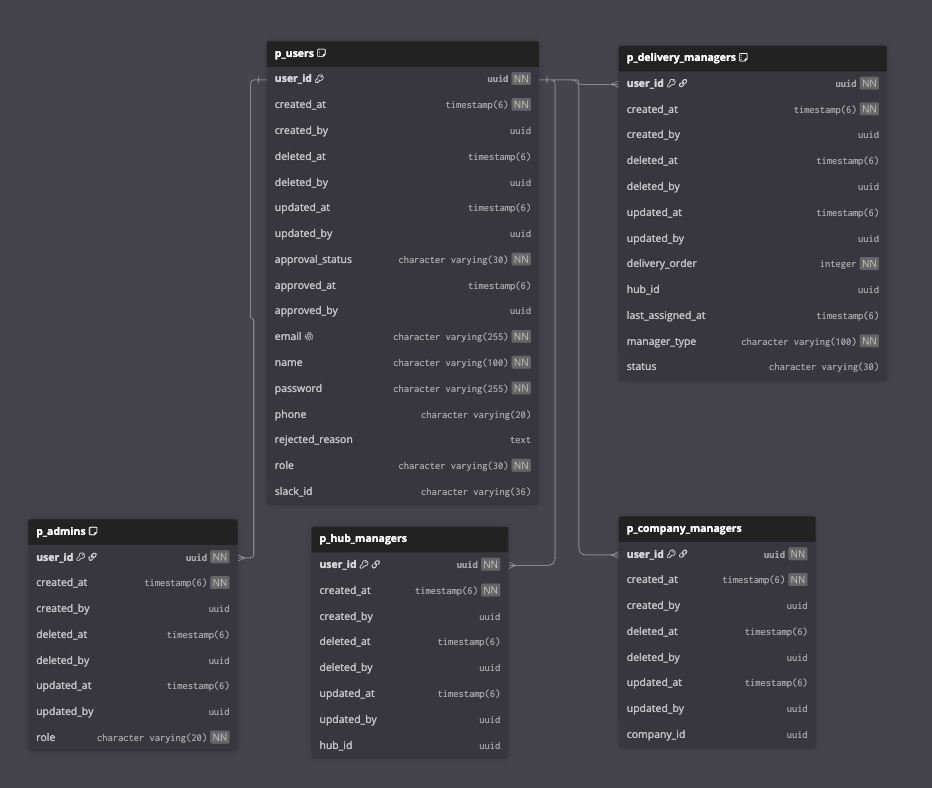
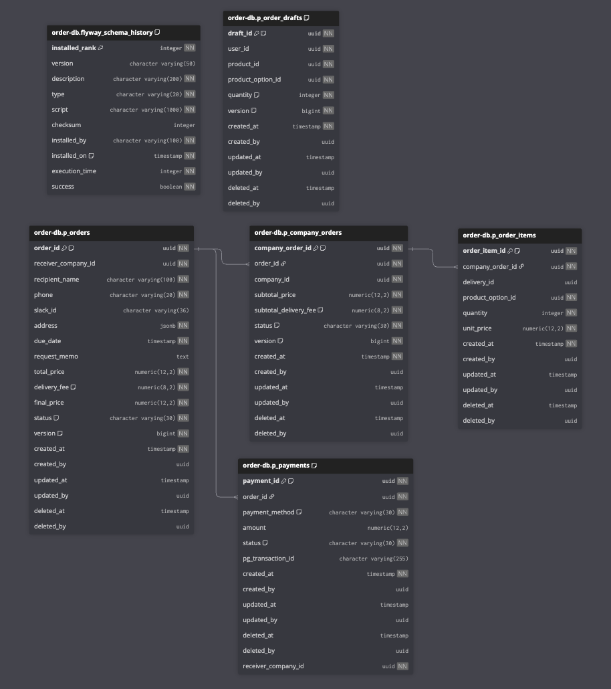
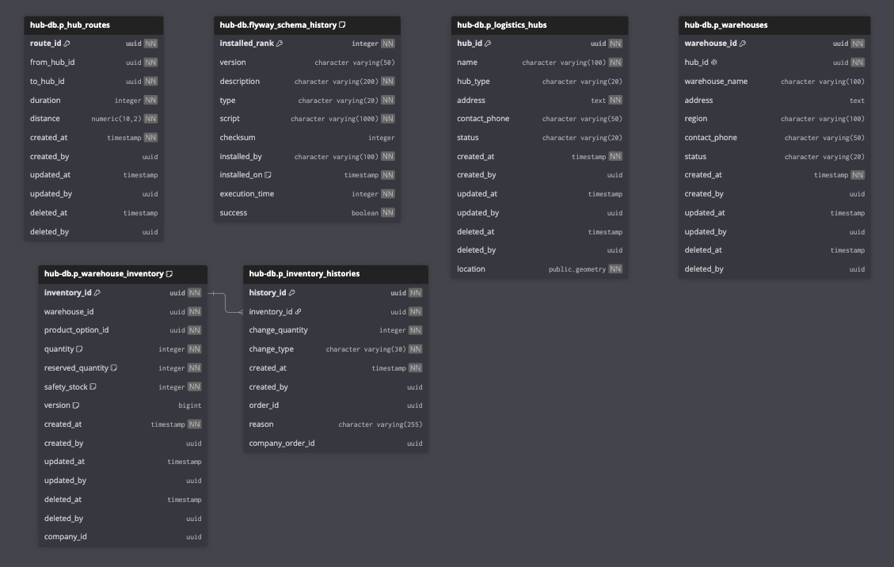
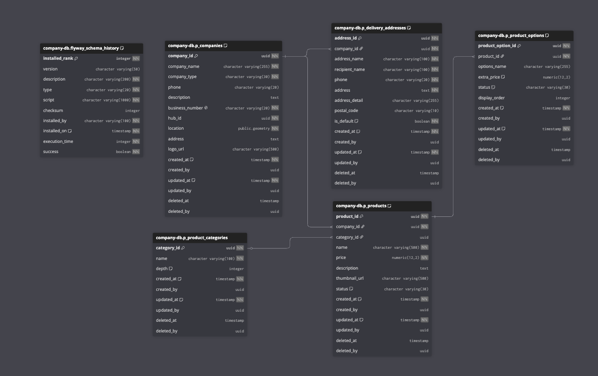
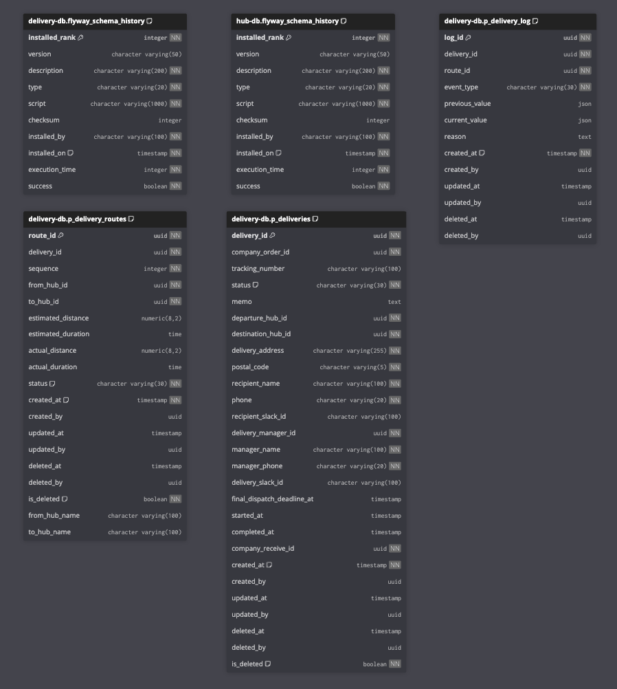
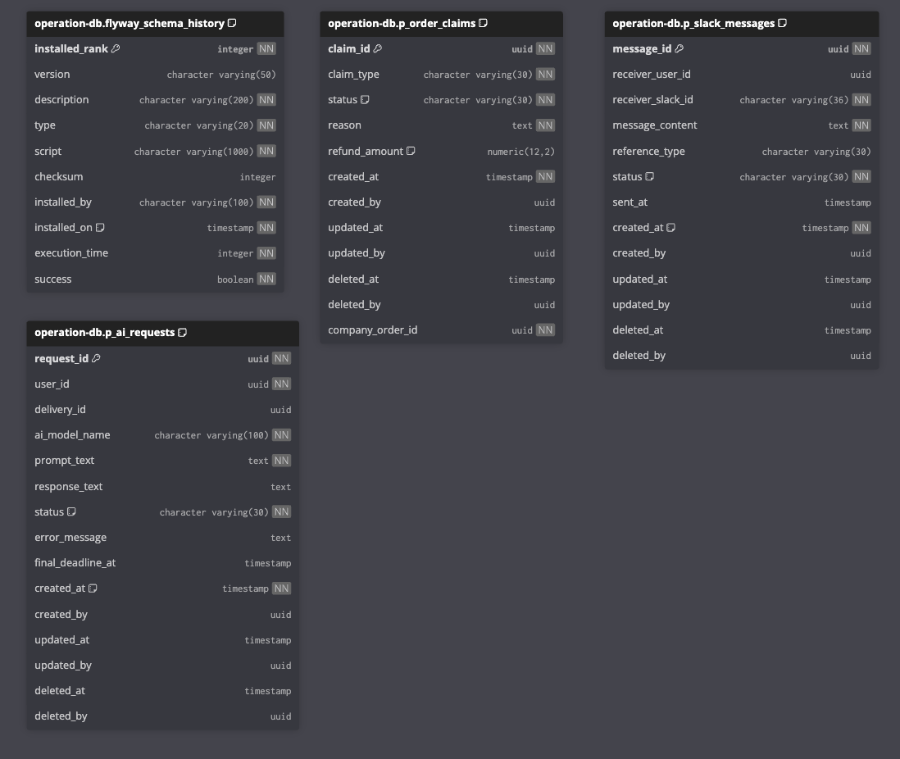
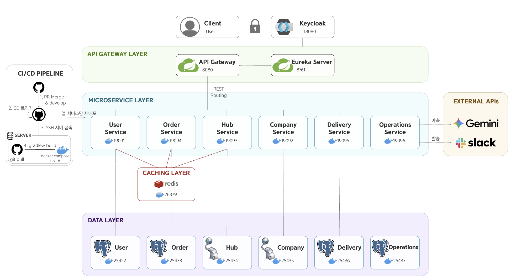

<div align="center">
  

  <h1>SPARTA Logistics</h1>


<hr />
  <p>MSA 기반 국내 B2B 물류 관리 및 배송 최적화 플랫폼</p>
</div>

---

## 목차

- [프로젝트 소개](#프로젝트-소개)
- [프로젝트 목표](#프로젝트-목표)
- [배포 주소](#배포-주소)
- [팀원 소개](#팀원-소개)
- [기술 스택](#기술-스택)
- [마이크로서비스 구성](#마이크로서비스-구성)
- [패키지 구조](#패키지-구조)
- [도메인 정의](#도메인-정의)
- [핵심 비즈니스 로직](#핵심-비즈니스-로직)
- [ERD 명세서](#erd-명세서)
- [API 명세서](#api-명세서)
- [인프라 아키텍처](#인프라-아키텍처)
- [CI/CD](#cicd)
- [실행 방법](#실행-방법)

---

## 프로젝트 소개

전국 물류 허브 네트워크를 기반으로 기업 간(B2B) 상품 주문 및 배송 프로세스를 자동화하는 MSA 플랫폼입니다.

- Spring Cloud(Eureka, Gateway, FeignClient) 기반 마이크로서비스 아키텍처
- Keycloak + JWT 기반 인증/인가 및 역할별 권한 관리 (MASTER / HUB_MANAGER / HUB_DELIVERY_MANAGER / COMPANY_DELIVERY_MANAGER / COMPANY_MANAGER)
- Redis Cache-Aside 전략을 활용한 허브·경로 정보 캐싱
- Saga 오케스트레이션 패턴을 통한 분산 트랜잭션 처리 (주문 → 재고 예약 → 배송 생성)
- Google Gemini API 연동을 통한 최적 발송 시한 자동 산출 및 Slack 알림 발송
- P2P + Hub-to-Hub Relay 방식의 허브 간 경로 모델 적용
- 모든 엔티티 Soft Delete 처리 (`deleted_at`, `deleted_by`)

---

## 프로젝트 목표

- Spring Cloud 기반 MSA 설계 및 서비스 간 통신 구현
- 분산 환경에서의 데이터 일관성 확보 (Saga 패턴, 낙관적 락)
- 컨테이너 기반 로컬 실행 환경 구축 (Docker Compose)
- 생성형 AI API를 실서비스에 연동하는 경험
- DDD 기반 레이어드 아키텍처 적용 및 코드 품질 관리 (ArchUnit, Checkstyle)

---

## 배포 주소

- **API Gateway** : `http://<서버IP>:8080` (배포 중단 예정 2026-06-01)

---

## 팀원 소개

|                     **도경민(Leader)**                     |                       **노동완**                        |                          **김민우**                           |                          **서동원**                          |                         **이선진**                          |
|:-------------------------------------------------------:|:----------------------------------------------------:|:----------------------------------------------------------:|:---------------------------------------------------------:|:--------------------------------------------------------:|
|  |  |  |  |  |
|       [@mindyhere](https://github.com/mindyhere)        |         [@Wansix](https://github.com/Wansix)         |      [@rlaalsdn0421](https://github.com/rlaalsdn0421)      |      [@won2dev-lab](https://github.com/won2dev-lab)       |       [@Seonjin-13](https://github.com/Seonjin-13)       |
|                      Order Service                      |        Operations Service<br>Company Service         |     Delivery Service<br>Operations Service (AI/Slack)      |                       User Service                        |                       Hub Service                        |

---

## 기술 스택

| 분류       | 기술                                                                                                                                                                                                                                                                                                                                                                                                                                                                                                                                                                                                                                                                                                                                                                                           |
|:---------|:---------------------------------------------------------------------------------------------------------------------------------------------------------------------------------------------------------------------------------------------------------------------------------------------------------------------------------------------------------------------------------------------------------------------------------------------------------------------------------------------------------------------------------------------------------------------------------------------------------------------------------------------------------------------------------------------------------------------------------------------------------------------------------------------|
| Backend  |        |
| Auth     |                                                                                                                                                                                                                                                                                                                                                                                                                                                                                                                                                                                               |
| Database |                                                                                                                                                                                                                                                                                                                                                                                                                                                                                           | |
| AI       |                                                                                                                                                                                                                                                                                                                                                                                                                                                                                                                                                                                                                                                                                     |
| Infra    |                                                                                                                                                                                                                                                                                                                                                                                                                             |
| Tools    |                                                                                                                                                                                                                                                                                                                                                                                                                                                                                                       |
| CI/CD    |                                                                                                                                                                                                                                                                                                                                                                                                                                                                                                                                                                                                                                                                           |
| Quality  |                                                                                                                                                                                                                                                                                                                                                                                                                                                                                                                      |
---

## 마이크로서비스 구성

| 서비스명               |  포트   |           DB 컨테이너            | 핵심 기능                            |
|:-------------------|:-----:|:----------------------------:|:---------------------------------|
| eureka-server      | 8761  |              -               | 서비스 디스커버리                        |
| api-gateway        | 8080  |              -               | 라우팅, JWT 인증/인가                   |
| config-server      | 8888  |              -               | 중앙 설정 관리                         |
| user-service       | 19091 |         my-postgres          | 인증/인가, 역할 관리, 승인 기반 가입, 배송담당자 관리 |
| company-service    | 19092 | company_service_db (PostGIS) | 업체/상품 마스터 데이터 관리                 |
| hub-service        | 19093 |   hub_service_db (PostGIS)   | 허브 및 경로 관리, 재고(SKU) 관리, Redis 캐싱 |
| order-service      | 19094 |       order_service_db       | 통합/업체별 주문 관리, 임시 주문, 결제          |
| delivery-service   | 19095 |     delivery_service_db      | 배송 추적, 경로 관리, 이벤트 로그             |
| operations-service | 19096 |    operations_service_db     | AI 발송 시한 산출, 슬랙 알림, 클레임 관리       |

> 마이크로서비스 포트(19091~19096)는 내부 네트워크로만 통신하며 외부에 노출되지 않습니다.
> 모든 외부 요청은 API Gateway(8080)를 통해서만 접근 가능합니다.

### DB 물리적 분리

서비스별로 독립된 PostgreSQL 컨테이너를 사용합니다.
company-service와 hub-service는 지리 데이터 처리를 위해 PostGIS 이미지를 사용합니다.

```
[my-postgres        :25432] ← user-service
[order_service_db   :25433] ← order-service
[hub_service_db     :25434] ← hub-service (PostGIS 16-3.4)
[company_service_db :25435] ← company-service (PostGIS 16-3.4)
[delivery_service_db:25436] ← delivery-service
[operations_service_db:25437] ← operations-service

[msa-redis    :26379] ← Redis
[my-keycloak  :18080] ← Keycloak
```

---

## 패키지 구조

<details>
<summary>패키지 구조 보기</summary>

각 마이크로서비스는 아래와 같은 DDD 기반 4계층 레이어드 아키텍처를 따릅니다.

```
com.sparta.{service-name}
│
├── {domain}/
│   ├── presentation/               ← 표현 계층
│   │   ├── controller/
│   │   └── dto/
│   │
│   ├── application/                ← 응용 계층
│   │   ├── service/
│   │   ├── dto/
│   │   └── port/                   ← 외부 의존 인터페이스
│   │
│   ├── domain/                     ← 도메인 계층
│   │   ├── core/                   ← 엔티티, 상태값 Enum
│   │   └── repository/             ← 순수 Java Interface
│   │
│   └── infrastructure/             ← 인프라스트럭처 계층
│       ├── repository/             ← JpaRepository 구현체
│       └── client/                 ← FeignClient (서비스 간 통신)
│
└── global/                         ← 공통 설정, 예외, 보안
    ├── config/
    ├── exception/
    └── security/
```

주요 서비스별 도메인 구성:

```
user-service
├── auth/         ← 로그인, 토큰 (Keycloak 연동)
├── user/         ← 사용자 엔티티 (Admin, HubManager, DeliveryManager, CompanyManager)
├── admin/        ← 가입 승인/거절
└── delivery/     ← 배송담당자 관리, 순번 기반 자동 배정

company-service
├── company/      ← 업체 (생산업체/수령업체), 배송지
└── product/      ← 상품, 상품 카테고리, 상품 옵션 (SKU)

hub-service
├── hub/          ← 허브 CRUD, Redis 캐싱
├── hubroute/     ← 허브 간 경로, P2P+Relay 모델
├── warehouse/    ← 창고 관리
└── inventory/    ← 재고(SKU), 재고 변동 이력 (낙관적 락)

order-service
├── draft/        ← 임시 주문 (장바구니)
└── order/        ← 주문, 업체별 주문, 결제, Saga 오케스트레이션

delivery-service
├── delivery/     ← 배송 전체 상태 관리
├── deliveryRoute/← 허브 간 경로 기록 (시퀀스 관리)
└── deliveryLog/  ← 배송 이벤트 로그 (append-only)

operations-service
├── claim/        ← 클레임 접수/처리 (반품·교환·파손·오배송)
├── slack/        ← Slack 메시지 발송 이력
└── ai/           ← Gemini API 요청/응답 로그, 발송 시한 산출
```

</details>

---

## 도메인 정의

| 도메인        | 설명                                     |
|:-----------|:---------------------------------------|
| User       | 회원가입(승인 기반), 로그인, 역할별 권한 관리, 배송담당자 프로필 |
| Company    | 생산업체/수령업체 관리, 상품·옵션(SKU)·배송지 관리        |
| Hub        | 전국 허브, 허브 간 이동 경로, 창고 및 재고 관리          |
| Order      | 임시 주문(장바구니), 주문 생성/취소, 업체별 주문 분리, 결제   |
| Delivery   | 배송 전체 상태, 허브 간 경로 기록, 배송 이벤트 로그        |
| Operations | 클레임 처리, AI 발송 시한 산출, Slack 알림 발송       |

### 권한 체계

| 역할                         | 설명                      |
|:---------------------------|:------------------------|
| `MASTER`                   | 모든 기능 전체 권한             |
| `HUB_MANAGER`              | 담당 허브의 배송담당자, 업체, 상품 관리 |
| `HUB_DELIVERY_MANAGER`     | 허브 간 배송 전담              |
| `COMPANY_DELIVERY_MANAGER` | 최종 허브 → 수령업체 배송 전담      |
| `COMPANY_MANAGER`          | 소속 업체 정보 및 등록 상품 관리     |

### 상태 흐름

**회원가입**
```
PENDING(가입 요청) → APPROVED(승인 완료)
                 → REJECTED(거절)
```

**주문**
```
PENDING(주문대기) → DELIVERING(배송중) → COMPLETED(배송완료)
                → CANCELLED(주문취소)
```

**배송**
```
PENDING(배송대기) → SHIPPING(배송중) → COMPLETED(배송완료)
                → CANCELLED(배송취소)
```

**배송 경로**
```
PENDING(대기) → MOVING(이동중) → ARRIVED(도착완료)
             → CANCELLED(취소)
```

---

## 핵심 비즈니스 로직

### 주문 및 출고 프로세스 (Saga 오케스트레이션)

```
1. 임시주문      Order Service — p_order_drafts에 품목 담기
      ↓
2. 주문 생성     Order Service — p_orders / p_company_orders 생성
      ↓
2-0. Hub ID 조회  Company Service (FeignClient)
                  실패 시 주문 생성 중단 (DB 미변경)
      ↓
2-1. 재고 예약   Hub Service (FeignClient)
                  실패 시 중단 / 성공 시 보상 등록: cancelStock
      ↓
2-2. 배송 생성   Delivery Service (FeignClient)
                  실패 시 보상 실행: cancelStock → 중단
                  성공 시 보상 등록: cancelDeliveries
      ↓
3. 출고 준비     Hub Service — p_company_orders.status → PREPARING
      ↓
4. 출고          Order Service — status → DELIVERING
                 Hub Service — 실재고 차감
      ↓
5. AI 분석       Operations Service → Gemini API — 최종 발송 시한 계산
      ↓
6. 슬랙 알림     Operations Service → 허브 담당자에게 발송 시한 전송
```

### AI 발송 시한 계산

Gemini API에 아래 정보를 전달해 `final_deadline_at`을 산출합니다.

- 상품 및 수량 정보
- 주문 요청사항 (납기일자 및 시간)
- 발송지 / 경유지 / 도착지 정보
- 배송담당자 근무시간 (09:00 ~ 18:00)

슬랙 발송 예시:
```
주문 번호: 1
주문자 정보: 김말숙 / msk@seafood.world
상품 정보: 마른 오징어 50박스
요청 사항: 5월 29일 3시까지 납품 부탁드립니다
발송지: 경기 북부 센터 / 도착지: 부산시 사하구 해산물월드

→ 최종 발송 시한: 5월 27일 오전 9시
```

---

## ERD 명세서

<details>
<summary>V1</summary>



</details>

<details>
<summary>V2</summary>

### User


### Order


### Hub


### Company


### Delivery


### Operations


</details>

---

## API 명세서

> **공통 사항**
> - Base URL: `http://localhost:8080/api/v1`
> - 인증: JWT (`Authorization: Bearer {token}`), 회원가입·로그인 제외
> - Content-Type: `application/json`
> - 페이지네이션: size는 10 / 30 / 50만 허용, 그 외 기본 10건
> - 정렬: 기본 `createdAt,DESC`

| 서비스                | API 명세                                                                                                                                                                                                                                            |
|:-------------------|:--------------------------------------------------------------------------------------------------------------------------------------------------------------------------------------------------------------------------------------------------|
| User Service       | [](https://editor.swagger.io/?url=https://raw.githubusercontent.com/B2B-team2/delivering/develop/docs/swagger/user-service.json)       |
| Company Service    | [](https://editor.swagger.io/?url=https://raw.githubusercontent.com/B2B-team2/delivering/develop/docs/swagger/company-service.json)    |
| Hub Service        | [](https://editor.swagger.io/?url=https://raw.githubusercontent.com/B2B-team2/delivering/develop/docs/swagger/hub-service.json)        |
| Order Service      | [](https://editor.swagger.io/?url=https://raw.githubusercontent.com/B2B-team2/delivering/develop/docs/swagger/order-service.json)      |
| Delivery Service   | [](https://editor.swagger.io/?url=https://raw.githubusercontent.com/B2B-team2/delivering/develop/docs/swagger/delivery-service.json)   |
| Operations Service | [](https://editor.swagger.io/?url=https://raw.githubusercontent.com/B2B-team2/delivering/develop/docs/swagger/operations-service.json) |
---

## 인프라 아키텍처

<details>
<summary>인프라 다이어그램</summary>



</details>

---

## CI/CD

GitHub Actions 기반으로 CI/CD 파이프라인이 구성되어 있으며, 결과는 Discord로 알림을 받습니다.

### CI — 빌드 및 테스트

`main`, `develop` 브랜치에 push 또는 PR이 열릴 때 자동 실행됩니다.

```
push / PR (main, develop)
      ↓
GitHub Actions (ubuntu-latest)
      ├── Java 17 세팅
      ├── ./gradlew clean build   ← Checkstyle + ArchUnit + 테스트 포함
      └── Discord 알림 (시작 / 성공 / 실패)
```

### CD — 서버 배포

`develop` 브랜치에 push될 때 자동 실행됩니다. 서버에서 직접 소스를 풀받아 로컬 빌드 후 Docker 이미지를 생성하는 방식입니다.

- **배포 서버:** Vultr
- **배포 방식:** SSH 접속 → git pull → Gradle 빌드 → Docker Compose 재시작

```
push (develop)
      ↓
GitHub Actions (ubuntu-latest)
      ├── Discord 알림 (CD 시작)
      ├── SSH 접속 (Vultr 서버)
      │     ├── git pull origin develop
      │     ├── ./gradlew clean build -x test   ← 서버에서 직접 빌드
      │     └── docker compose up --build -d    ← 이미지 재생성 후 컨테이너 재시작
      └── Discord 알림 (성공 / 실패)
```

### GitHub Actions Secrets

| Secret                | 설명                |
|:----------------------|:------------------|
| `DISCORD_WEBHOOK_URL` | Discord 알림 웹훅 URL |
| `SERVER_HOST`         | Vultr 서버 IP       |
| `SERVER_USERNAME`     | 서버 접속 유저명         |
| `SERVER_SSH_KEY`      | SSH 개인키           |

---

## 실행 방법

### 사전 요구사항

- Java 17
- Docker & Docker Compose

### 환경 변수 설정

프로젝트 루트 디렉토리에 `.env` 파일을 생성합니다. `.env.example`을 참고하세요.

```env
# User DB
USER_DB_URL=jdbc:postgresql://{HOST}:25432/user_service_db
USER_DB_USERNAME=your_db_username
USER_DB_PASSWORD=your_db_password

# Order DB
ORDER_DB_URL=jdbc:postgresql://{HOST}:25433/order_service_db
ORDER_DB_USERNAME=your_db_username
ORDER_DB_PASSWORD=your_db_password

# Hub DB
HUB_DB_URL=jdbc:postgresql://{HOST}:25434/hub_service_db
HUB_DB_USERNAME=your_db_username
HUB_DB_PASSWORD=your_db_password

# Company DB
COMPANY_DB_URL=jdbc:postgresql://{HOST}:25435/company_service_db
COMPANY_DB_USERNAME=your_db_username
COMPANY_DB_PASSWORD=your_db_password

# Delivery DB
DELIVERY_DB_URL=jdbc:postgresql://{HOST}:25436/delivery_service_db
DELIVERY_DB_USERNAME=your_db_username
DELIVERY_DB_PASSWORD=your_db_password

# Operations DB
OPERATIONS_DB_URL=jdbc:postgresql://{HOST}:25437/operations_service_db
OPERATIONS_DB_USERNAME=your_db_username
OPERATIONS_DB_PASSWORD=your_db_password

# Keycloak
KEYCLOAK_SERVER_URL=http://{HOST}:18080
KEYCLOAK_CLIENT_SECRET=your_keycloak_client_secret
KEYCLOAK_ADMIN_USERNAME=your_keycloak_admin_username
KEYCLOAK_ADMIN_PASSWORD=your_keycloak_admin_password

# Redis
REDIS_HOST={HOST}
REDIS_PORT=26379
REDIS_PASSWORD=your_redis_password

# Gateway
GATEWAY_SECRET=your_gateway_secret

# Gemini
GEMINI_URL=your_gemini_url
GEMINI_API_KEY=your_gemini_api_key
```

### Compose 파일 분리 구조

인프라(`docker-compose.infra.yml`)와 앱 서비스(`docker-compose.yml`)를 분리하여 관리합니다.
앱 재배포나 핫픽스 적용 시 인프라(DB·Redis·Keycloak)를 재시작하지 않고
앱 서비스만 독립적으로 올리고 내릴 수 있도록 하기 위함입니다.

| 명령어                                               | 영향 범위                |
|:--------------------------------------------------|:---------------------|
| `docker compose down`                             | 앱 서비스만 종료, DB 유지     |
| `docker compose -f docker-compose.infra.yml down` | DB·Redis·Keycloak 종료 |

### 실행 순서

```bash
# 1. 저장소 클론
git clone https://github.com/B2B-team2/delivering.git
cd delivering

# 2. .env 파일 생성 (위 내용 참고)

# 3. 인프라 먼저 실행 (DB / Redis / Keycloak)
docker compose -f docker-compose.infra.yml up -d

# 4. Gradle 빌드 (Docker 이미지 생성 전 필수)
./gradlew clean build -x test

# 5. 앱 서비스 실행
docker compose up -d --build

# 6. 기동 순서 (healthcheck 기반 자동 관리)
# 1단계: zipkin
# 2단계: config-server (healthcheck 통과 후)
# 3단계: eureka-server (healthcheck 통과 후)
# 4단계: api-gateway + 마이크로서비스 6개

# 7. 종료
docker compose down
docker compose -f docker-compose.infra.yml down
```

### 서비스별 접속 주소

| 서비스                  | 주소                                    |
|:---------------------|:--------------------------------------|
| API Gateway          | http://localhost:8080                 |
| Eureka Dashboard     | http://localhost:8761                 |
| Zipkin               | http://localhost:9411                 |
| Swagger (Gateway 통합) | http://localhost:8080/swagger-ui.html |