# 03 - Data Spec

> 공통 규칙, ERD, 테이블 명세, 인덱스 가이드

---

## 1. 공통 규칙

### 1.1 공통 감사 필드 (Audit Fields)

모든 테이블에 아래 필드가 공통 포함된다.

| 컬럼명 | 타입 | 제약 | 설명 |
|---|---|---|---|
| `created_at` | TIMESTAMP | Not Null, Default now() | 데이터 최초 생성 일시 |
| `created_by` | VARCHAR(36) | - | 생성 주체 (user_id) |
| `updated_at` | TIMESTAMP | Not Null, Default now() | 데이터 최근 수정 일시 |
| `updated_by` | VARCHAR(36) | - | 최근 수정 주체 |
| `deleted_at` | TIMESTAMP | - | 삭제 일시 (Soft Delete) |
| `deleted_by` | VARCHAR(36) | - | 삭제 처리 주체 |

> `p_delivery_log`는 append-only 테이블로 `created_at`, `created_by`만 존재한다.

### 1.2 ID 규칙
- 모든 PK는 **UUID** 타입 사용
- `p_delivery_addresses.address_id`는 예외적으로 `VARCHAR(36)`

### 1.3 논리적 삭제
- 조회 시 `deleted_at IS NULL` 조건 필수 적용
- 물리적 삭제 금지

### 1.4 데이터베이스 분리
- 서비스별 **독립 PostgreSQL 인스턴스**로 물리적 데이터 격리 (`docker-compose.infra.yml`)
- hub-service / company-service는 PostGIS 확장 적용 (지리 데이터 처리)

| 서비스 | DB 컨테이너 | 호스트 포트 | 이미지 |
|---|---|:---:|---|
| user-service | my-postgres | 25432 | postgres:16-alpine |
| order-service | order_service_db | 25433 | postgres:16-alpine |
| hub-service | hub_service_db | 25434 | postgis/postgis:16-3.4 |
| company-service | company_service_db | 25435 | postgis/postgis:16-3.4 |
| delivery-service | delivery_service_db | 25436 | postgres:16-alpine |
| operations-service | operations_service_db | 25437 | postgres:16-alpine |

---

## 2. ERD

ERD 원본: https://dbdiagram.io/d/Copy-of-Untitled-Diagram-6a06dfff9f1f8ec47b1f0a26

```mermaid
erDiagram
    %% ── USER Domain (user_service_db) ──
    p_users {
        UUID user_id PK
        VARCHAR email
        VARCHAR password
        VARCHAR name
        VARCHAR phone
        VARCHAR slack_id
        VARCHAR role
        VARCHAR approval_status
        UUID approved_by
        TIMESTAMP approved_at
        TEXT rejected_reason
    }
    p_admins {
        UUID user_id PK,FK
        VARCHAR role
    }
    p_hub_managers {
        UUID user_id PK,FK
        UUID hub_id
    }
    p_company_managers {
        UUID user_id PK,FK
        UUID company_id
    }
    p_delivery_managers {
        UUID user_id PK,FK
        VARCHAR manager_type
        INTEGER delivery_order
        UUID hub_id
        VARCHAR status
        TIMESTAMP last_assigned_at
    }

    %% ── HUB Domain (hub_service_db) ──
    p_logistics_hubs {
        UUID hub_id PK
        VARCHAR name
        VARCHAR hub_type
        TEXT address
        GEOMETRY location
        VARCHAR contact_phone
        VARCHAR status
    }
    p_hub_routes {
        UUID route_id PK
        UUID from_hub_id
        UUID to_hub_id
        INTEGER duration
        NUMERIC distance
    }
    p_warehouses {
        UUID warehouse_id PK
        UUID hub_id
        VARCHAR warehouse_name
        TEXT address
        VARCHAR region
        VARCHAR contact_phone
        VARCHAR status
    }
    p_warehouse_inventory {
        UUID inventory_id PK
        UUID warehouse_id FK
        UUID product_option_id
        UUID company_id
        INTEGER quantity
        INTEGER reserved_quantity
        INTEGER safety_stock
        BIGINT version
    }
    p_inventory_histories {
        UUID history_id PK
        UUID inventory_id FK
        UUID order_id
        UUID company_order_id
        INTEGER change_quantity
        VARCHAR change_type
        VARCHAR reason
    }

    %% ── COMPANY Domain (company_service_db) ──
    p_companies {
        UUID company_id PK
        VARCHAR company_name
        VARCHAR company_type
        VARCHAR phone
        TEXT description
        VARCHAR business_number
        UUID hub_id
        GEOMETRY location
        TEXT address
        VARCHAR logo_url
    }
    p_product_categories {
        UUID category_id PK
        VARCHAR name
        INTEGER depth
    }
    p_products {
        UUID product_id PK
        UUID company_id FK
        UUID category_id FK
        VARCHAR name
        NUMERIC price
        TEXT description
        VARCHAR thumbnail_url
        VARCHAR status
    }
    p_product_options {
        UUID product_option_id PK
        UUID product_id FK
        VARCHAR options_name
        NUMERIC extra_price
        VARCHAR status
        INTEGER display_order
    }
    p_delivery_addresses {
        UUID address_id PK
        UUID company_id FK
        VARCHAR address_name
        VARCHAR recipient_name
        VARCHAR phone
        TEXT address
        VARCHAR address_detail
        VARCHAR postal_code
        BOOLEAN is_default
    }

    %% ── ORDER Domain (order_service_db) ──
    p_orders {
        UUID order_id PK
        UUID receiver_company_id
        VARCHAR recipient_name
        VARCHAR phone
        VARCHAR slack_id
        JSONB address
        TIMESTAMP due_date
        TEXT request_memo
        NUMERIC total_price
        NUMERIC delivery_fee
        NUMERIC final_price
        VARCHAR status
        BIGINT version
    }
    p_company_orders {
        UUID company_order_id PK
        UUID order_id FK
        UUID company_id
        NUMERIC subtotal_price
        NUMERIC subtotal_delivery_fee
        VARCHAR status
        BIGINT version
    }
    p_order_items {
        UUID order_item_id PK
        UUID company_order_id FK
        UUID delivery_id
        UUID product_option_id
        INTEGER quantity
        NUMERIC unit_price
    }
    p_order_drafts {
        UUID draft_id PK
        UUID user_id
        UUID product_id
        UUID product_option_id
        INTEGER quantity
        BIGINT version
    }
    p_payments {
        UUID payment_id PK
        UUID order_id FK
        UUID receiver_company_id
        VARCHAR payment_method
        NUMERIC amount
        VARCHAR status
        VARCHAR pg_transaction_id
    }

    %% ── DELIVERY Domain (delivery_service_db) ──
    p_deliveries {
        UUID delivery_id PK
        UUID company_order_id
        UUID company_receive_id
        VARCHAR tracking_number
        VARCHAR status
        TEXT memo
        UUID departure_hub_id
        UUID destination_hub_id
        VARCHAR delivery_address
        VARCHAR recipient_name
        VARCHAR phone
        VARCHAR postal_code
        VARCHAR recipient_slack_id
        UUID delivery_manager_id
        VARCHAR manager_name
        VARCHAR manager_phone
        VARCHAR delivery_slack_id
        TIMESTAMP final_dispatch_deadline_at
        TIMESTAMP started_at
        TIMESTAMP completed_at
    }
    p_delivery_routes {
        UUID route_id PK
        UUID delivery_id FK
        INTEGER sequence
        UUID from_hub_id
        UUID to_hub_id
        NUMERIC estimated_distance
        TIME estimated_duration
        NUMERIC actual_distance
        TIME actual_duration
        VARCHAR status
    }
    p_delivery_log {
        UUID log_id PK
        UUID delivery_id FK
        UUID route_id FK
        VARCHAR event_type
        JSON previous_value
        JSON current_value
        TEXT reason
    }

    %% ── OPS Domain (operations_service_db) ──
    p_order_claims {
        UUID claim_id PK
        UUID company_order_id
        VARCHAR claim_type
        VARCHAR status
        TEXT reason
        NUMERIC refund_amount
    }
    p_slack_messages {
        UUID message_id PK
        UUID receiver_user_id
        VARCHAR receiver_slack_id
        TEXT message_content
        VARCHAR reference_type
        VARCHAR status
        TIMESTAMP sent_at
    }
    p_ai_requests {
        UUID request_id PK
        UUID user_id
        UUID delivery_id
        VARCHAR ai_model_name
        TEXT prompt_text
        TEXT response_text
        VARCHAR status
        TEXT error_message
        TIMESTAMP final_deadline_at
    }

    %% ── Relations: USER (물리 FK — 같은 DB) ──
    p_users ||--o| p_admins : "is admin"
    p_users ||--o| p_hub_managers : "is hub manager"
    p_users ||--o| p_company_managers : "is company manager"
    p_users ||--o| p_delivery_managers : "is delivery manager"

    %% ── Relations: HUB (물리 FK — 같은 DB) ──
    p_logistics_hubs ||--|| p_warehouses : "has warehouse"
    p_logistics_hubs ||--o{ p_hub_routes : "from hub"
    p_logistics_hubs ||--o{ p_hub_routes : "to hub"
    p_warehouses ||--o{ p_warehouse_inventory : "stores"
    p_warehouse_inventory ||--o{ p_inventory_histories : "history"

    %% ── Relations: COMPANY (물리 FK — 같은 DB) ──
    p_companies ||--o{ p_products : "produces"
    p_companies ||--o{ p_delivery_addresses : "has address"
    p_product_categories ||--o{ p_products : "categorizes"
    p_products ||--o{ p_product_options : "has options"

    %% ── Relations: ORDER (물리 FK — 같은 DB) ──
    p_orders ||--o{ p_company_orders : "split by company"
    p_company_orders ||--o{ p_order_items : "contains"
    p_orders ||--o| p_payments : "paid via"

    %% ── Relations: DELIVERY (물리 FK — 같은 DB) ──
    p_deliveries ||--o{ p_delivery_routes : "has routes"
    p_deliveries ||--o{ p_delivery_log : "logs"
    p_delivery_routes ||--o{ p_delivery_log : "route logs"

    %% ── Relations: OPS ──
    p_company_orders ||--o{ p_order_claims : "claimed"
    p_users ||--o{ p_slack_messages : "receives message"
    p_users ||--o{ p_ai_requests : "requests AI"
    p_deliveries ||--o{ p_ai_requests : "AI analyzed"
```

---
## 3. 테이블 명세

> 각 테이블은 해당 서비스의 독립 PostgreSQL 데이터베이스에 속한다. 스키마명은 논리적 구분 목적으로만 표기한다.

### 3.1 USER 스키마 (`user_service_db`)

#### p_users (사용자 공통 정보)

| 컬럼명 | 타입 | 제약 | 설명 |
|---|---|---|---|
| `user_id` | UUID | PK, Not Null | 사용자 고유 식별자 (Keycloak ID 사용) |
| `email` | VARCHAR(255) | Unique, Not Null | 로그인 계정 (이메일) |
| `password` | VARCHAR(255) | Not Null | 암호화된 비밀번호 |
| `name` | VARCHAR(100) | Not Null | 사용자 실명 |
| `phone` | VARCHAR(20) | nullable | 연락처 |
| `slack_id` | VARCHAR(36) | nullable | 슬랙 ID |
| `role` | VARCHAR(30) | Not Null | MASTER / HUB_MANAGER / HUB_DELIVERY_MANAGER / COMPANY_DELIVERY_MANAGER / COMPANY_MANAGER |
| `approval_status` | VARCHAR(30) | Not Null, Default 'PENDING' | PENDING / APPROVED / REJECTED |
| `approved_by` | UUID | FK(자기참조), nullable | 승인 처리 관리자 ID |
| `approved_at` | TIMESTAMP | nullable | 승인 일시 |
| `rejected_reason` | TEXT | nullable | 거절 사유 |

#### 역할별 프로필 테이블

| 테이블 | 주요 컬럼 | 설명 |
|---|---|---|
| `p_company_managers` | user_id(PK/FK), company_id(FK, nullable) | 업체 담당자 — company_id는 승인 시점에 연결 |
| `p_admins` | user_id(PK/FK), role(MASTER) | 시스템 운영진 |
| `p_hub_managers` | user_id(PK/FK), hub_id(FK, nullable) | 허브 관리자 — hub_id는 승인 시점에 연결 |
| `p_delivery_managers` | user_id(PK/FK), manager_type, delivery_order, hub_id, status, last_assigned_at | 배송 담당자 |

**p_delivery_managers 상세**

| 컬럼명 | 타입 | 설명 |
|---|---|---|
| `manager_type` | VARCHAR(100) | HUB_DELIVERY / COMPANY_DELIVERY |
| `delivery_order` | INTEGER | 배송 순번 (자동 배정 기준) |
| `hub_id` | UUID | 담당 허브 ID |
| `status` | VARCHAR(30) | 근무 상태: WAITING / DELIVERING / INACTIVE |
| `last_assigned_at` | TIMESTAMP | 마지막 배정 일시 |

---

### 3.2 COMPANY 스키마 (`company_service_db`)

#### p_companies (업체)

| 컬럼명 | 타입 | 제약 | 설명 |
|---|---|---|---|
| `company_id` | UUID | PK, Not Null | 업체 식별자 |
| `company_name` | VARCHAR(255) | Not Null | 업체명 |
| `company_type` | VARCHAR(30) | Not Null | PRODUCER / RECEIVER |
| `phone` | VARCHAR(20) | - | 연락처 |
| `description` | TEXT | - | 업체 설명 |
| `business_number` | VARCHAR(20) | Not Null | 사업자 등록 번호 |
| `hub_id` | UUID | FK, Not Null | 소속 허브 |
| `location` | GEOMETRY(Point,4326) | Not Null | 위경도 좌표 (PostGIS Point — longitude=X, latitude=Y) |
| `address` | TEXT | - | 소재지 |
| `logo_url` | VARCHAR(500) | - | 로고 URL |

> `location` 컬럼에서 위도는 `location.getY()`, 경도는 `location.getX()`로 접근한다.

#### p_product_categories (상품 분류)

| 컬럼명 | 타입 | 제약 | 설명 |
|---|---|---|---|
| `category_id` | UUID | PK, Not Null | 카테고리 식별자 |
| `name` | VARCHAR(100) | Not Null | 분류명 |
| `depth` | INTEGER | Default 1 | 계층 깊이 (대분류/중분류) |

#### p_products (상품)

| 컬럼명 | 타입 | 제약 | 설명 |
|---|---|---|---|
| `product_id` | UUID | PK, Not Null | 상품 식별자 |
| `company_id` | UUID | FK, Not Null | 생산업체 참조 |
| `category_id` | UUID | FK | 카테고리 참조 |
| `name` | VARCHAR(500) | Not Null | 상품명 |
| `price` | NUMERIC(12,2) | Not Null | 판매 정가 |
| `description` | TEXT | - | 상품 설명 |
| `thumbnail_url` | VARCHAR(500) | - | 썸네일 URL |
| `status` | VARCHAR(30) | Default 'ON_SALE' | ON_SALE / SOLD_OUT |

#### p_product_options (상품 옵션 — SKU 단위)

| 컬럼명 | 타입 | 제약 | 설명 |
|---|---|---|---|
| `product_option_id` | UUID | PK, Not Null | 상품옵션 식별자 |
| `product_id` | UUID | FK, Not Null | 상품 참조 |
| `options_name` | VARCHAR(255) | - | 옵션 조합명 (예: "블랙/256GB") |
| `extra_price` | NUMERIC(12,2) | Default 0 | 옵션별 추가금액 |
| `status` | VARCHAR(30) | Default 'ON_SALE' | ON_SALE / SOLD_OUT |
| `display_order` | INTEGER | - | 화면 노출 순서 |

> 옵션 없는 상품도 기본 옵션 1개 반드시 존재

#### p_delivery_addresses (배송지 관리)

| 컬럼명 | 타입 | 제약 | 설명 |
|---|---|---|---|
| `address_id` | UUID | PK, Not Null | 배송지 고유 식별자 |
| `company_id` | UUID | FK, Not Null | 업체 참조 |
| `address_name` | VARCHAR(100) | Not Null | 배송지 별칭 |
| `recipient_name` | VARCHAR(100) | Not Null | 수령인 실명 |
| `phone` | VARCHAR(20) | Not Null | 수령인 연락처 |
| `address` | TEXT | Not Null | 기본 주소 |
| `address_detail` | VARCHAR(255) | - | 상세 주소 |
| `postal_code` | VARCHAR(10) | - | 우편번호 |
| `is_default` | BOOLEAN | Not Null, Default false | 기본 배송지 여부 |

---

### 3.3 HUB 스키마 (`hub_service_db`)

#### p_logistics_hubs (물류 허브)

| 컬럼명 | 타입 | 제약 | 설명 |
|---|---|---|---|
| `hub_id` | UUID | PK, Not Null | 물류허브 식별자 |
| `name` | VARCHAR(100) | Not Null | 허브명 |
| `hub_type` | VARCHAR(30) | - | REGIONAL / CENTRAL |
| `address` | TEXT | Not Null | 주소 |
| `location` | GEOMETRY(Point,4326) | Not Null | 위치 좌표 (위도/경도) |
| `contact_phone` | VARCHAR(20) | - | 연락처 |
| `status` | VARCHAR(30) | Default 'ACTIVE' | ACTIVE / INACTIVE / MAINTENANCE |

> 허브 정보는 **고정 데이터**로, 시스템 초기 구동 시 아래 17개 센터를 seed 데이터로 삽입한다.
> 허브 정보 변경이 거의 없으므로 Redis Cache-Aside 전략으로 캐싱한다.

##### 고정 허브 목록 (Seed Data)

| # | 허브명 | hub_type | 주소 |
|:---:|---|:---:|---|
| 1 | 서울특별시 센터 | REGIONAL | 서울특별시 송파구 송파대로 55 |
| 2 | 경기 북부 센터 | REGIONAL | 경기도 고양시 덕양구 권율대로 570 |
| 3 | 경기 남부 센터 | CENTRAL | 경기도 이천시 덕평로 257-21 |
| 4 | 인천광역시 센터 | REGIONAL | 인천 남동구 정각로 29 |
| 5 | 강원특별자치도 센터 | REGIONAL | 강원특별자치도 춘천시 중앙로 1 |
| 6 | 대전광역시 센터 | CENTRAL | 대전 서구 둔산로 100 |
| 7 | 세종특별자치시 센터 | REGIONAL | 세종특별자치시 한누리대로 2130 |
| 8 | 충청북도 센터 | REGIONAL | 충북 청주시 상당구 상당로 82 |
| 9 | 충청남도 센터 | REGIONAL | 충남 홍성군 홍북읍 충남대로 21 |
| 10 | 전북특별자치도 센터 | REGIONAL | 전북특별자치도 전주시 완산구 효자로 225 |
| 11 | 광주광역시 센터 | REGIONAL | 광주 서구 내방로 111 |
| 12 | 전라남도 센터 | REGIONAL | 전남 무안군 삼향읍 오룡길 1 |
| 13 | 대구광역시 센터 | CENTRAL | 대구 북구 태평로 161 |
| 14 | 경상북도 센터 | REGIONAL | 경북 안동시 풍천면 도청대로 455 |
| 15 | 경상남도 센터 | REGIONAL | 경남 창원시 의창구 중앙대로 300 |
| 16 | 부산광역시 센터 | REGIONAL | 부산 동구 중앙대로 206 |
| 17 | 울산광역시 센터 | REGIONAL | 울산 남구 중앙로 201 |

> `CENTRAL` (경기남부·대전·대구): 지리적으로 전국 중앙에 위치하여 200km 이상 배송 시 자연스럽게 중간 경유지로 선택되는 거점. 라우팅 알고리즘에서 강제 경유가 아닌 **최적 경유 후보**로 활용된다. 중앙허브와 일반허브 역할 모두 수행한다.

##### 허브 경로 모델 — P2P + Hub to Hub Relay

본 프로젝트는 **P2P + Hub to Hub Relay** 모델을 채택한다.

**핵심 규칙**

| 조건 | 처리 방식 |
|---|---|
| 출발 허브 ↔ 도착 허브 직선 거리 **< 200km** | 중간 경유 없이 직접 배송 (P2P) |
| 출발 허브 ↔ 도착 허브 직선 거리 **≥ 200km** | 중간 경유지를 추가하여 각 구간을 200km 미만으로 분할 (Relay) |

- `p_hub_routes`에 허브 간 직접 이동 정보(거리·소요시간)를 저장한다.
- 경로 탐색(`POST /hub-routes/search`) 시 중간 경유지를 포함한 전체 구간을 반환한다.
- 중간 경유지 선택 알고리즘은 팀 결정에 따라 구현한다.
  - 예시 1) 출발지와 목적지의 지리적 중간에 위치한 허브 선택
  - 예시 2) 목적지에 가장 가까운 허브를 순차적으로 선택

**경로 예시**

| 출발 | 도착 | 직선 거리 | 경로 |
|---|---|:---:|---|
| 서울 | 대구 | ~280km | 서울 → 대전(160km) → 대구(120km) |
| 서울 | 부산 | ~320km | 서울 → 대전(160km) → 부산(160km) |
| 경기남부 | 부산 | ~330km | 경기남부 → 대구(170km) → 부산(160km) |
| 인천 | 광주 | ~230km | 인천 → 대전(130km) → 광주(100km) |
| 서울 | 대전 | ~160km | 서울 → 대전 (직접, 200km 미만) |

#### p_hub_routes (허브 간 이동 경로)

| 컬럼명 | 타입 | 제약 | 설명 |
|---|---|---|---|
| `route_id` | UUID | PK, Not Null | 경로 식별자 |
| `from_hub_id` | UUID | FK, Not Null | 출발 허브 |
| `to_hub_id` | UUID | FK, Not Null | 도착 허브 |
| `duration` | INTEGER | Not Null | 소요 시간(분) |
| `distance` | NUMERIC(10,2) | Not Null | 이동 거리(km) |

#### p_warehouses (물류 창고)

| 컬럼명 | 타입 | 제약 | 설명 |
|---|---|---|---|
| `warehouse_id` | UUID | PK, Not Null | 창고 식별자 |
| `hub_id` | UUID | FK, Not Null, Unique | 관할 허브 (1:1 제약) |
| `warehouse_name` | VARCHAR(255) | - | 창고명 |
| `address` | TEXT | - | 물류창고 주소 |
| `region` | VARCHAR(255) | - | 관할 권역 |
| `contact_phone` | VARCHAR(20) | - | 연락처 |
| `status` | VARCHAR(30) | Default 'ACTIVE' | ACTIVE / INACTIVE / MAINTENANCE |

#### p_warehouse_inventory (실시간 재고)

| 컬럼명 | 타입 | 제약 | 설명 |
|---|---|---|---|
| `inventory_id` | UUID | PK, Not Null | 재고 기록 식별자 |
| `warehouse_id` | UUID | FK, Not Null | 창고 참조 |
| `product_option_id` | UUID | FK, Not Null | 상품 옵션(SKU) 참조 |
| `quantity` | INTEGER | Default 0, Not Null | 실제 출고 가능한 가용 재고 |
| `reserved_quantity` | INTEGER | Default 0, Not Null | 결제 대기 중인 예약 재고 |
| `safety_stock` | INTEGER | Default 0, Not Null | 최소 안전 재고 (발주 기준점) |
| `company_id` | UUID | - | 소속 업체 ID |
| `version` | BIGINT | Default 0 | 낙관적 락용 버전 (`@Version`) |

#### p_inventory_histories (재고 변동 이력 — append-only)

| 컬럼명 | 타입 | 제약 | 설명 |
|---|---|---|---|
| `history_id` | UUID | PK, Not Null | 이력 식별자 |
| `inventory_id` | UUID | FK, Not Null | 대상 재고 참조 |
| `change_quantity` | INTEGER | Not Null | 수량 변동 (+/-) |
| `order_id` | UUID | - | 연관 주문 ID |
| `reason` | VARCHAR(255) | - | 변동 사유 |
| `company_order_id` | UUID | - | 연관 업체별 주문 ID |
| `change_type` | VARCHAR(30) | Default 'INBOUND' | INBOUND / OUTBOUND / RESERVED / CANCELLED / ADJUSTED / RETURNED |

---

### 3.4 ORDER 스키마 (`order_service_db`)

#### p_orders (주문)

| 컬럼명 | 타입 | 제약 | 설명 |
|---|---|---|---|
| `order_id` | UUID | PK, Not Null | 주문 식별자 |
| `receiver_company_id` | UUID | FK, Not Null | 수령업체 |
| `recipient_name` | VARCHAR(100) | Not Null | 수령인 실명 (스냅샷) |
| `phone` | VARCHAR(20) | Not Null | 수령인 연락처 (스냅샷) |
| `slack_id` | VARCHAR(36) | nullable | 수령인 슬랙 ID |
| `address` | JSONB | Not Null | 배송 주소 스냅샷 `{"address": "...", "address_detail": "..."}` |
| `due_date` | TIMESTAMP | Not Null | 납품 기한 |
| `request_memo` | TEXT | nullable | 요청 사항 |
| `total_price` | NUMERIC(12,2) | Not Null | 상품 합계 금액 |
| `delivery_fee` | NUMERIC(8,2) | Default 0 | 총 배송비 |
| `final_price` | NUMERIC(12,2) | Not Null | 최종 결제 금액 |
| `status` | VARCHAR(30) | Default 'PENDING' | PENDING / DELIVERING / COMPLETED / CANCELLED |
| `version` | BIGINT | Not Null | 낙관적 락용 버전 (`@Version`) |

> `requester_company_id` 컬럼 제거 확정. 공급업체 정보는 `p_company_orders.company_id`로 관리.

#### p_company_orders (업체별 주문)

| 컬럼명 | 타입 | 제약 | 설명 |
|---|---|---|---|
| `company_order_id` | UUID | PK, Not Null | 업체별 주문 식별자 (미리 생성 후 저장) |
| `order_id` | UUID | FK, Not Null | 상위 주문 참조 |
| `company_id` | UUID | FK, Not Null | 업체 참조 |
| `subtotal_price` | NUMERIC(12,2) | Not Null | 주문 상품 합계 |
| `subtotal_delivery_fee` | NUMERIC(8,2) | Default 0 | 배송비 |
| `status` | VARCHAR(30) | Default 'ORDERED' | ORDERED / PREPARING / SHIPPED / DELIVERED / CANCELLED |
| `version` | BIGINT | Not Null | 낙관적 락용 버전 (`@Version`) |

#### p_order_items (주문 상품 상세)

| 컬럼명 | 타입 | 제약 | 설명 |
|---|---|---|---|
| `order_item_id` | UUID | PK, Not Null | 주문 상품 식별자 |
| `delivery_id` | UUID | FK | 배송 참조 |
| `product_option_id` | UUID | FK, Not Null | 상품 옵션 참조 |
| `company_order_id` | UUID | FK, Not Null | 업체별 서브 주문 참조 |
| `quantity` | INTEGER | Not Null | 구매 수량 |
| `unit_price` | NUMERIC(12,2) | Not Null | 구매 시점 단가 (스냅샷) |

#### p_order_drafts (주문 임시저장)

| 컬럼명 | 타입 | 제약 | 설명          |
|---|---|---|-------------|
| `draft_id` | UUID | PK, Not Null | 임시주문 상품 식별자 |
| `user_id` | UUID | FK, Not Null | 사용자 참조 |
| `product_id` | UUID | FK, Not Null | 상품 참조 |
| `product_option_id` | UUID | FK, Not Null | 상품옵션 참조 |
| `quantity` | INTEGER | Not Null, Default 1 | 주문 수량 (1 ~ 9,999,999) |
| `version` | BIGINT | Not Null | 낙관적 락용 버전 (`@Version`) |

#### p_payments (결제)

| 컬럼명 | 타입 | 제약 | 설명 |
|---|---|---|---|
| `payment_id` | UUID | PK, Not Null | 결제 식별자 |
| `order_id` | UUID | FK, Not Null | 주문 참조 |
| `payment_method` | VARCHAR(30) | Not Null, Default 'CARD' | 결제 방식 (CARD만 허용) |
| `amount` | NUMERIC(12,2) | - | 결제 금액 |
| `status` | VARCHAR(30) | Not Null, Default 'PENDING' | PENDING / COMPLETED / CANCELLED |
| `pg_transaction_id` | VARCHAR(255) | - | PG사 거래 고유번호 |
| `receiver_company_id` | UUID | Not Null | 수령업체 ID (반정규화) |

---

### 3.5 DELIVERY 스키마 (`delivery_service_db`)

#### p_deliveries (배송 정보)

| 컬럼명 | 타입 | 제약 | 설명 |
|---|---|---|---|
| `delivery_id` | UUID | PK, Not Null | 배송 고유 식별자 |
| `company_order_id` | UUID | Not Null | 업체별 주문 참조 |
| `company_receive_id` | UUID | Not Null | 수령업체 ID |
| `tracking_number` | VARCHAR(100) | - | 송장 번호 |
| `status` | VARCHAR(30) | Not Null, Default 'PENDING' | PENDING / SHIPPING / COMPLETED / CANCELLED |
| `postal_code` | VARCHAR(5) | Not Null | 우편번호 |
| `memo` | TEXT | - | 배송 메모 |
| `departure_hub_id` | UUID | Not Null | 출발 허브 |
| `destination_hub_id` | UUID | Not Null | 도착 허브 |
| `delivery_address` | VARCHAR(255) | Not Null | 최종 도착지 주소 (JSON: address + address_detail 등) |
| `recipient_name` | VARCHAR(100) | Not Null | 수령인 실명 |
| `phone` | VARCHAR(20) | Not Null | 수령인 연락처 |
| `recipient_slack_id` | VARCHAR(100) | - | 수령인 슬랙 ID |
| `company_receive_id` | UUID | - | 수령업체 ID |
| `delivery_manager_id` | UUID | FK, Not Null | 배송 담당자 |
| `manager_name` | VARCHAR(100) | - | 배송담당자명 (스냅샷) |
| `manager_phone` | VARCHAR(20) | - | 배송담당자 연락처 (스냅샷) |
| `delivery_slack_id` | VARCHAR(100) | - | 배송담당자 Slack ID |
| `final_dispatch_deadline_at` | TIMESTAMP | - | AI 응답 기반 최종 발송 시한 |
| `started_at` | TIMESTAMP | - | 배송 시작 시간 |
| `completed_at` | TIMESTAMP | - | 배송 완료 시간 |
| `is_deleted` | BOOLEAN | Not Null, Default false | 삭제 플래그 (Soft Delete) |

#### p_delivery_routes (배송 경로)

| 컬럼명 | 타입 | 제약 | 설명 |
|---|---|---|---|
| `route_id` | UUID | PK, Not Null | 배송 경로 식별자 |
| `delivery_id` | UUID | FK, Not Null | 배송 참조 |
| `sequence` | INTEGER | Not Null | 경로 순서 |
| `from_hub_id` | UUID | FK, Not Null | 출발 허브 |
| `to_hub_id` | UUID | FK, Not Null | 도착 허브 |
| `estimated_distance` | NUMERIC(8,2) | - | 예상 거리 (km) |
| `estimated_duration` | TIME | - | 예상 소요시간 |
| `from_hub_name` | VARCHAR(100) | - | 출발 허브명 (캐시용 스냅샷) |
| `to_hub_name` | VARCHAR(100) | - | 도착 허브명 (캐시용 스냅샷) |
| `actual_distance` | NUMERIC(8,2) | - | 실제 거리 |
| `actual_duration` | TIME | - | 실제 소요시간 |
| `status` | VARCHAR(30) | Not Null, Default 'PENDING' | PENDING / MOVING / ARRIVED / CANCELLED |

#### p_delivery_log (이벤트 발생 로그)

| 컬럼명 | 타입 | 제약 | 설명 |
|---|---|---|---|
| `log_id` | UUID | PK, Not Null | 배송 이력 식별자 |
| `delivery_id` | UUID | Not Null | 배송 참조 |
| `route_id` | UUID | Not Null | 배송 경로 참조 |
| `event_type` | VARCHAR(30) | Not Null | MANAGER_ASSIGNED / MANAGER_CHANGED / STATUS_CHANGED / ROUTE_CHANGED / CANCELLED |
| `previous_value` | JSON | nullable | 변경 전 값 |
| `current_value` | JSON | nullable | 변경 후 값 |
| `reason` | TEXT | - | 변경 사유 |

---

### 3.6 OPS 스키마 (`operations_service_db`)

#### p_order_claims (반품/교환)

| 컬럼명 | 타입 | 제약 | 설명 |
|---|---|---|---|
| `claim_id` | UUID | PK, Not Null | 클레임 고유 식별자 |
| `company_order_id` | UUID | Not Null | 대상 업체별 주문 참조 |
| `claim_type` | VARCHAR(30) | Not Null | RETURN / EXCHANGE |
| `status` | VARCHAR(30) | Not Null, Default 'REQUESTED' | REQUESTED / PROCESSING / REJECTED / COMPLETED / CANCELLED |
| `reason` | TEXT | Not Null | 요청 사유 |
| `refund_amount` | NUMERIC(12,2) | Default 0 | 최종 환불 승인 금액 |

#### p_slack_messages (슬랙 메시지 발송 이력)

| 컬럼명 | 타입 | 제약 | 설명 |
|---|---|---|---|
| `message_id` | UUID | PK, Not Null | 메시지 고유 식별자 |
| `receiver_user_id` | UUID | FK | 수신 대상자 ID |
| `receiver_slack_id` | VARCHAR(36) | Not Null | 발송 슬랙 수신자 ID |
| `message_content` | TEXT | Not Null | 메시지 본문 |
| `reference_type` | VARCHAR(30) | - | 관련 도메인 타입 (ORDER, DELIVERY 등) |
| `status` | VARCHAR(30) | Not Null, Default 'PENDING' | PENDING / SENT / FAILED |
| `sent_at` | TIMESTAMP | - | 실제 슬랙 발송 시각 |

#### p_ai_requests (AI 요청 로그)

| 컬럼명 | 타입 | 제약 | 설명 |
|---|---|---|---|
| `request_id` | UUID | PK, Not Null | AI 요청 고유 식별자 |
| `user_id` | UUID | FK | 요청 발생 사용자 |
| `delivery_id` | UUID | FK, nullable | 연관 배송 건 |
| `ai_model_name` | VARCHAR(100) | Not Null | 사용된 AI 모델명 |
| `prompt_text` | TEXT | Not Null | 프롬프트 전문 |
| `response_text` | TEXT | nullable | AI 응답 전문 |
| `status` | VARCHAR(30) | Not Null, Default 'PENDING' | PENDING / SUCCESS / FAILED |
| `error_message` | TEXT | nullable | 실패 원인 |
| `final_deadline_at` | TIMESTAMP | nullable | AI가 도출한 최종 발송 시한 |

---

## 4. 인덱스 가이드

| 테이블 | 인덱스 컬럼 | 이유 |
|---|---|---|
| `p_users` | `email` | 로그인 시 이메일 조회 (Unique) |
| `p_users` | `approval_status` | 가입 대기 목록 필터 |
| `p_companies` | `hub_id` | 허브별 업체 조회 |
| `p_products` | `company_id`, `status` | 업체별 판매 중 상품 조회 |
| `p_warehouse_inventory` | `warehouse_id`, `product_option_id` | 재고 조회 (복합 Unique) |
| `p_orders` | `receiver_company_id`, `status` | 수령업체별 주문 필터 |
| `p_company_orders` | `order_id` | 주문별 서브 주문 조회 |
| `p_deliveries` | `company_order_id` | 주문별 배송 조회 |
| `p_deliveries` | `tracking_number` | 송장 번호 조회 |
| `p_delivery_routes` | `delivery_id`, `sequence` | 경로 순서 조회 |
| `p_delivery_log` | `delivery_id` | 배송 이벤트 이력 조회 |
| `p_order_claims` | `order_item_id` | 주문 상품별 클레임 조회 |
| `p_slack_messages` | `status` | 발송 대기/실패 메시지 재시도 |
| 공통 | `deleted_at` | Soft Delete 필터 (NULL 여부) |
